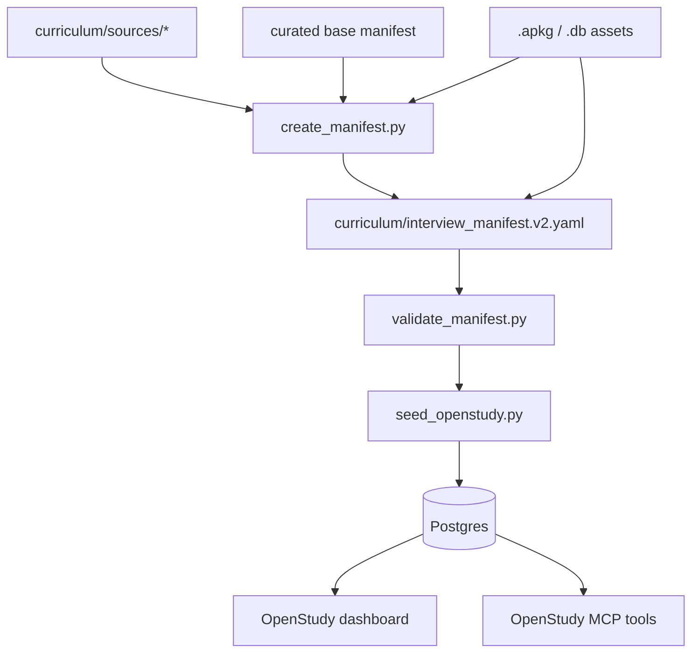
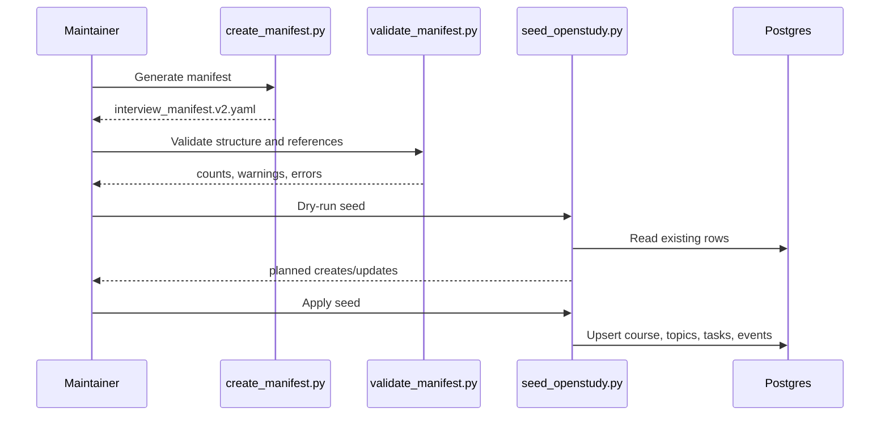

# Architecture

Interview Engineering is an OpenStudy curriculum layer, not a fork of the core
OpenStudy app model. The core platform still provides the dashboard, database,
tasks, study topics, files, MCP tools, authentication, and deployment stack. The
curriculum layer adds a deterministic manifest pipeline and an idempotent seed
process.

## Components



## Layers

### OpenStudy Base Platform

OpenStudy provides:

- FastAPI backend
- Postgres persistence through `app/db.py`
- React frontend
- task and study topic views
- file storage under `STUDY_ROOT`
- MCP access over `/mcp`
- Docker Compose deployment via `deploy.sh`

The curriculum work intentionally avoids broad core app changes. It maps into
existing tables where possible and stores curriculum-specific details in JSON
metadata fields.

### Curriculum Source Layer

Local source repositories live under:

```text
curriculum/sources/
```

They are treated as references, not content to duplicate. Lessons link back to
repository IDs, relative paths, and optional headings.

### Manifest Layer

The manifest is the portable curriculum contract. It describes sources, tracks,
modules, lessons, assets, dependencies, difficulty, cognitive load, estimated
effort, and completion criteria.

There are two important manifest files:

- `curriculum/manifests/interview-engineering.yaml`: curated base curriculum.
- `curriculum/interview_manifest.v2.yaml`: generated enriched manifest used by
  validation and seeding.

The generated manifest is deterministic so it can be reviewed in Git and
recreated during deployment.

### Database Seed Layer

`scripts/curriculum/seed_openstudy.py` imports the generated manifest into the
existing OpenStudy database. It is idempotent: running it multiple times updates
the same rows instead of creating duplicates.

## Source Repositories

| Source | Purpose | Manifest Role |
| --- | --- | --- |
| `coding-interview-university` | Core computer science and interview study structure | Reading lessons and source references |
| `interactive-coding-challenges` | Notebook-based coding challenge practice | Coding exercise lessons and Anki deck asset |
| `system-design-primer` | System design concepts and interview examples | System design lessons and Anki deck assets |
| `computer-science-flash-cards` | Flashcard databases | Flashcard database assets |
| `practice-c` | C implementation practice | Compact supplemental module |
| `practice-cpp` | C++ implementation practice | Compact supplemental module |
| `practice-python` | Python implementation practice | Compact supplemental module |

The practice repositories are intentionally compressed into one supplemental
module each. Expanding every implementation directory into a lesson would create
too much task noise for the first version of the dashboard.

## Data Flow



## Design Decisions

### Generated, Not Hand-Duplicated

The upstream repositories are large and independently maintained. The manifest
stores references and metadata rather than copying content. This keeps the
OpenStudy curriculum maintainable and attribution-preserving.

### Stable IDs

Tracks, modules, lessons, and assets use stable global kebab-case IDs. These IDs
are natural keys for validation, seeding, and future scheduling.

### Metadata Before Migrations

The current OpenStudy schema does not have dedicated curriculum source, asset,
or dependency tables. The seed script stores these details in existing JSON or
text metadata fields. This keeps the integration small and reversible.

### Assets Are Metadata-Only

Flashcard decks and databases are discovered and represented in the manifest,
but not parsed. The learner imports `.apkg` files into Anki manually, and the
dashboard can display or track the metadata later.

## Operational Boundary

The curriculum scripts do not:

- modify source submodules
- run database migrations
- restart containers
- parse Anki or SQLite card content
- create external services
- assume Coolify specifically

Deployment remains the responsibility of `deploy.sh`, Docker Compose, or the
hosting platform. Curriculum seeding is a post-deploy operation.

