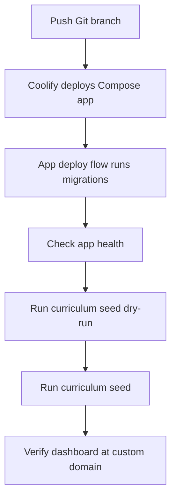

# Coolify Deployment

Coolify can deploy OpenStudy from Git using the repository Docker Compose file.
The curriculum seed remains a manual post-deploy operation.

This page avoids Coolify-specific assumptions beyond common Git and Docker
Compose behavior. Adjust names to match your project and server.

## Recommended Shape

- Source: Git repository containing OpenStudy.
- Build: Docker Compose.
- Services: `postgres`, `openstudy`, `frontend`.
- Persistent database volume or bind mount for Postgres data.
- Persistent course file bind mount for `/opt/courses`.
- Public domain points to the frontend service.

## Environment Variables

The Compose file is configured for Coolify-injected environment variables. Add
these values in Coolify's environment manager rather than relying on
repository-local `env_file` entries.

Required application values:

```text
APP_PASSWORD_HASH=...
SESSION_SECRET=...
```

Required database values:

```text
POSTGRES_USER=openstudy
POSTGRES_PASSWORD=<strong-password>
POSTGRES_DB=openstudy
```

Recommended domain/build values:

```text
PUBLIC_SITE_URL=https://learn.alexmbugua.me
PUBLIC_SITE_NAME=OpenStudy
PUBLIC_SHOW_LANDING=false
PUBLIC_GOOGLE_SITE_VERIFICATION=
TZ=Africa/Nairobi
PYTHONUNBUFFERED=1
```

Keep secrets in Coolify's environment manager, not in Git.

## Persistent Storage

Postgres must persist between deployments. The repository Compose file uses:

```text
/opt/postgres-data:/var/lib/postgresql/data
```

OpenStudy file storage uses:

```text
/opt/courses:/opt/courses
```

In Coolify, ensure equivalent persistent storage exists for both paths or map
them to Coolify-managed volumes.

## Deployment Flow



## Manual Curriculum Seed

After Coolify deploys successfully and migrations have run, open a shell in the
`openstudy` container and run:

```bash
scripts/curriculum/deploy_seed_openstudy.sh --dry-run --verbose
```

Review the output. For an empty database, expect roughly:

```text
Courses: create=1, update=0
Sources: create=7, update=0
Assets: create=6, update=0
Tracks: create=1, update=0
Modules: create=16, update=0
Lessons/tasks: create=113, update=0
```

Then apply:

```bash
scripts/curriculum/deploy_seed_openstudy.sh --verbose
```

Repeat runs should show updates instead of creates.

## Updating The Curriculum

1. Update the curated manifest, generator, source repos, or tests locally.
2. Regenerate and validate.
3. Commit and push.
4. Let Coolify deploy the new image.
5. Run the seed helper dry-run in the `openstudy` container.
6. Apply the seed if the counts look correct.

## Logs And Troubleshooting

### App Health Fails

Check backend logs and database connectivity. The curriculum seed should wait
until app deployment and migrations are healthy.

### Seed Helper Cannot Find Python

Run it in the `openstudy` container, not the frontend container.

### Seed Helper Reports Missing DB Env

The shell does not have `POSTGRES_USER`, `POSTGRES_PASSWORD`, or `POSTGRES_DB`.
Use the backend container shell where Coolify/Compose injects those variables,
or configure them in the Coolify shell environment.

### Manifest Generation Fails

Check that `curriculum/sources/*` exists in the deployed image. If source repos
are Git submodules, make sure the deployment process checks out submodules.

### Assets Warn As Missing

The source repository was not present or the asset path changed. Regenerate the
manifest after fixing the source checkout.

## Common Mistakes

- Running the helper from the frontend container.
- Losing Postgres data because the database path is not persistent.
- Updating a source submodule locally but not pushing the submodule pointer.
- Applying the seed without checking dry-run counts.
- Assuming Coolify rollback reverses database seed changes.
