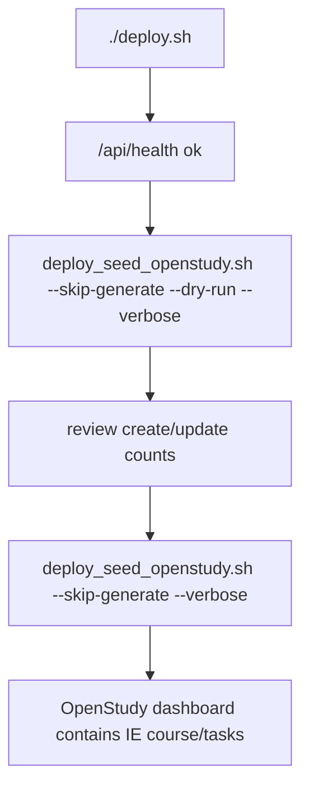

# Deployment

Deploy OpenStudy, run database migrations, reconcile the operator account,
verify health and login, then dry-run and apply the curriculum seed when the
manifest changed. Coolify operators should follow the canonical
[Coolify runbook](./coolify.md), which includes the current environment,
user-scoped storage migration, and password replacement procedure.

## Existing Deployment Flow

The repository already provides:

```bash
./deploy.sh
```

`deploy.sh` validates Docker Compose, builds images, starts Postgres, runs
migrations through `scripts/run_migrations.py`, migrates legacy course storage,
reconciles the operator through `scripts/seed_operator_password.py`, starts the
app and frontend, then polls `/api/health`. It also tags the previous image for
rollback.

Coolify's normal Compose deployment does not invoke `deploy.sh`; its migration,
storage, and operator-bootstrap commands must be run explicitly as documented
in [Coolify Deployment](./coolify.md).

The curriculum helper does not replace this. It runs after deployment.

## Post-Deploy Curriculum Flow



## Docker Compose Usage

Run the helper inside the backend container:

```bash
docker compose exec openstudy scripts/curriculum/deploy_seed_openstudy.sh --skip-generate --dry-run --verbose
docker compose exec openstudy scripts/curriculum/deploy_seed_openstudy.sh --skip-generate --verbose
```

This is preferred because the container already has:

- Python dependencies
- repository files
- database environment variables
- network access to the `postgres` service

## Helper Script

The helper is:

```text
scripts/curriculum/deploy_seed_openstudy.sh
```

It runs:

1. optionally `python scripts/curriculum/create_manifest.py --output curriculum/interview_manifest.v2.yaml --force`
2. `python scripts/curriculum/validate_manifest.py curriculum/interview_manifest.v2.yaml`
3. `python scripts/curriculum/seed_openstudy.py --manifest curriculum/interview_manifest.v2.yaml --dry-run --verbose`
4. `python scripts/curriculum/seed_openstudy.py --manifest curriculum/interview_manifest.v2.yaml --verbose`

Use `--dry-run` to skip step 4. In production containers, use
`--skip-generate` because the image ships with the prebuilt manifest and only
the flashcard asset files required at runtime, not the full source submodules.

## Environment Variables

The seed step needs database variables:

```text
POSTGRES_USER
POSTGRES_PASSWORD
POSTGRES_DB
PGHOST
PGPORT
```

In the Coolify-ready Compose file, database and application values are injected
through environment variable substitution. Configure them in Coolify, export
them in the shell before local Compose runs, or provide them through whatever
secret manager your deployment platform uses. In Coolify, let the platform
manage the Compose network rather than defining custom networks in the Compose
file.

Required runtime values:

```text
POSTGRES_USER=openstudy
POSTGRES_PASSWORD=<strong-password>
POSTGRES_DB=openstudy
OPERATOR_USER_ID=00000000-0000-0000-0000-000000000001
OPERATOR_EMAIL=you@example.com
OPERATOR_DISPLAY_NAME=Your Name
APP_PASSWORD_HASH=<argon2id-password-hash>
SESSION_SECRET=<random-session-secret>
SECRETS_ENCRYPTION_KEY=<persistent-fernet-key>
PUBLIC_BASE_URL=https://learn.alexmbugua.me
PUBLIC_URL=https://learn.alexmbugua.me
SIGNUPS_ENABLED=false
EMAIL_BACKEND=console
```

Optional runtime/build values:

```text
PUBLIC_SITE_URL=https://learn.alexmbugua.me
PUBLIC_SITE_NAME=OpenStudy
PUBLIC_SHOW_LANDING=false
PUBLIC_GOOGLE_SITE_VERIFICATION=
TZ=Africa/Nairobi
PYTHONUNBUFFERED=1
```

`PUBLIC_BASE_URL` is used by the backend for OAuth/MCP discovery URLs and
`WWW-Authenticate` metadata. The `PUBLIC_SITE_*` values are used by the
frontend build, not the curriculum seed. Login uses `OPERATOR_EMAIL` and the
plaintext password corresponding to `APP_PASSWORD_HASH`; the hash itself is
never entered in the login form.

## Local Production-Like Test

Use a temporary database for local verification:

```bash
docker run --rm --detach \
  --name openstudy-curriculum-seed-test \
  --env POSTGRES_USER=openstudy \
  --env POSTGRES_PASSWORD=testpw \
  --env POSTGRES_DB=openstudy_test \
  --publish 55433:5432 \
  postgres:16-alpine

env POSTGRES_USER=openstudy POSTGRES_PASSWORD=testpw POSTGRES_DB=openstudy_test \
  PGHOST=127.0.0.1 PGPORT=55433 \
  python scripts/run_migrations.py

env POSTGRES_USER=openstudy POSTGRES_PASSWORD=testpw POSTGRES_DB=openstudy_test \
  PGHOST=127.0.0.1 PGPORT=55433 \
  bash scripts/curriculum/deploy_seed_openstudy.sh --dry-run --verbose

docker stop openstudy-curriculum-seed-test
```

## Rollback Considerations

`deploy.sh` can roll back containers if health fails. Curriculum seeding is a
database operation and is not automatically rolled back by container rollback.

Practical guidance:

- Always run seed dry-run first.
- Back up Postgres before large curriculum changes.
- Prefer idempotent updates over `--reset`.
- Keep generated manifest changes in Git so the seeded state is reproducible.

## Backups

Before production seed changes, capture a database backup:

```bash
docker exec openstudy-postgres pg_dump -U openstudy openstudy > openstudy-before-curriculum.sql
```

Also back up any file storage under `/opt/courses` if you have learner files.

## Security Notes

- Do not expose Postgres publicly.
- Run seeding from the app container or a trusted server shell.
- Do not commit real secrets or generated local env files.
- Treat curriculum source repositories as read-only inputs.
- Review generated manifest diffs before applying production seeds.
- In Coolify, do not publish host ports or define custom networks for the
  public frontend route; use `expose: "80"` and the Traefik service-port label.

## Common Mistakes

- Running the seed helper before migrations.
- Assuming a Coolify Compose redeploy automatically invokes `deploy.sh`.
- Changing `APP_PASSWORD_HASH` and expecting the bootstrap script to overwrite
  an existing database password; use the current password procedure in
  [Coolify Deployment](./coolify.md).
- Running from the host without DB environment variables.
- Forgetting `--dry-run` before production seed.
- Running production seeding without `--skip-generate`.
- Defining custom Compose networks in Coolify and causing proxy 504s.
- Assuming packaging flashcard assets into `/app/curriculum/sources` is enough.
  They must also be synced into
  `/opt/courses/<user-id>/interview-engineering/resources/flashcards` before
  the Files pane and MCP file tools can see them; backend startup handles this
  when `OPENSTUDY_PACKAGED_CURRICULUM=1`.
- Rolling back the container and assuming database seed changes rolled back too.
