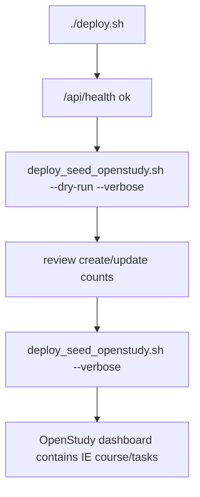

# Deployment

Curriculum seeding is a post-deploy operation. Deploy the OpenStudy app, run
database migrations, verify health, then generate, validate, dry-run, and apply
the curriculum seed.

## Existing Deployment Flow

The repository already provides:

```bash
./deploy.sh
```

`deploy.sh` validates Docker Compose, builds images, starts Postgres, runs
migrations through `scripts/run_migrations.py`, starts the app and frontend,
then polls `/api/health`. It also tags the previous image for rollback.

The curriculum helper does not replace this. It runs after deployment.

## Post-Deploy Curriculum Flow



## Docker Compose Usage

Run the helper inside the backend container:

```bash
docker compose exec openstudy scripts/curriculum/deploy_seed_openstudy.sh --dry-run --verbose
docker compose exec openstudy scripts/curriculum/deploy_seed_openstudy.sh --verbose
```

This is preferred because the container already has:

- Python dependencies
- repository files
- database environment variables
- network access to the `postgres` service

## Helper Script

The helper is:

```text
scripts/curriculum/deploy_seed_openstudy.sh
```

It runs:

1. `python scripts/curriculum/create_manifest.py --output curriculum/interview_manifest.v2.yaml --force`
2. `python scripts/curriculum/validate_manifest.py curriculum/interview_manifest.v2.yaml`
3. `python scripts/curriculum/seed_openstudy.py --manifest curriculum/interview_manifest.v2.yaml --dry-run --verbose`
4. `python scripts/curriculum/seed_openstudy.py --manifest curriculum/interview_manifest.v2.yaml --verbose`

Use `--dry-run` to skip step 4.

## Environment Variables

The seed step needs database variables:

```text
POSTGRES_USER
POSTGRES_PASSWORD
POSTGRES_DB
PGHOST
PGPORT
```

In Docker Compose, `.env.docker` provides the Postgres credentials and the app
container reaches Postgres on the internal Docker network.

For frontend/domain metadata, `.env.docker` may also include:

```text
PUBLIC_SITE_URL=https://learn.alexmbugua.me
PUBLIC_SITE_NAME=OpenStudy
PUBLIC_SHOW_LANDING=false
```

These are used by the frontend build, not the curriculum seed.

## Local Production-Like Test

Use a temporary database for local verification:

```bash
docker run --rm --detach \
  --name openstudy-curriculum-seed-test \
  --env POSTGRES_USER=openstudy \
  --env POSTGRES_PASSWORD=testpw \
  --env POSTGRES_DB=openstudy_test \
  --publish 55433:5432 \
  postgres:16-alpine

env POSTGRES_USER=openstudy POSTGRES_PASSWORD=testpw POSTGRES_DB=openstudy_test \
  PGHOST=127.0.0.1 PGPORT=55433 \
  python scripts/run_migrations.py

env POSTGRES_USER=openstudy POSTGRES_PASSWORD=testpw POSTGRES_DB=openstudy_test \
  PGHOST=127.0.0.1 PGPORT=55433 \
  bash scripts/curriculum/deploy_seed_openstudy.sh --dry-run --verbose

docker stop openstudy-curriculum-seed-test
```

## Rollback Considerations

`deploy.sh` can roll back containers if health fails. Curriculum seeding is a
database operation and is not automatically rolled back by container rollback.

Practical guidance:

- Always run seed dry-run first.
- Back up Postgres before large curriculum changes.
- Prefer idempotent updates over `--reset`.
- Keep generated manifest changes in Git so the seeded state is reproducible.

## Backups

Before production seed changes, capture a database backup:

```bash
docker exec openstudy-postgres pg_dump -U openstudy openstudy > openstudy-before-curriculum.sql
```

Also back up any file storage under `/opt/courses` if you have learner files.

## Security Notes

- Do not expose Postgres publicly.
- Run seeding from the app container or a trusted server shell.
- Do not commit `.env` or `.env.docker`.
- Treat curriculum source repositories as read-only inputs.
- Review generated manifest diffs before applying production seeds.

## Common Mistakes

- Running the seed helper before migrations.
- Running from the host without DB environment variables.
- Forgetting `--dry-run` before production seed.
- Assuming asset files are copied into OpenStudy storage.
- Rolling back the container and assuming database seed changes rolled back too.

