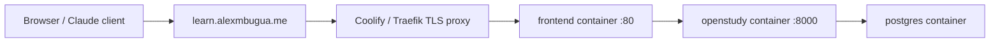

# Domain And SSL

This page uses `learn.alexmbugua.me` as a concrete example. Replace it with
your own hostname.

## Target Shape



The public domain should point at the frontend/reverse proxy entrypoint. The
frontend container serves the SPA and proxies API/MCP traffic to the backend on
the Compose network managed by Coolify.

## DNS

Create one DNS record:

```text
Type: A
Name: learn
Value: <server IPv4 address>
Proxy: optional, depending on provider
```

If your server has IPv6:

```text
Type: AAAA
Name: learn
Value: <server IPv6 address>
```

## Coolify Domain

In Coolify, attach the domain to the `frontend` service:

```text
https://learn.alexmbugua.me
```

Enable HTTPS/TLS in Coolify. Coolify should provision and renew certificates if
DNS is pointed correctly.

## Docker Compose Routing

For Coolify, do not define custom Compose networks and do not add host `ports:`
for the public site. Coolify attaches the deployment to its managed network and
Traefik reaches the frontend through the container's internal port.

Keep the frontend service configured with:

```yaml
expose:
  - "80"
labels:
  - "traefik.http.services.frontend.loadbalancer.server.port=80"
```

Do not attach the public domain to the `openstudy` backend or `postgres`.

### Non-Coolify Reverse Proxy

For a manually managed Docker host outside Coolify, you may choose to bind a
host port and point an outer proxy at it. That is not the Coolify deployment
shape used for `learn.alexmbugua.me`.

Example Caddy config for a non-Coolify host:

```caddy
learn.alexmbugua.me {
    encode gzip
    reverse_proxy 127.0.0.1:8080 {
        flush_interval -1
    }
}
```

`flush_interval -1` is useful for streaming endpoints such as MCP.

## Frontend Public URL

Set public frontend metadata before building:

```text
PUBLIC_SITE_URL=https://learn.alexmbugua.me
PUBLIC_SITE_NAME=OpenStudy
PUBLIC_SHOW_LANDING=false
```

These values are build-time frontend settings used for canonical URLs,
OpenGraph tags, robots, sitemap, and manifest metadata.

## Backend Public URL

OAuth and MCP clients need externally visible discovery URLs. Set the backend
public origin to the same HTTPS domain users access:

```text
PUBLIC_BASE_URL=https://learn.alexmbugua.me
```

This value is used for OAuth issuer and endpoint metadata, protected resource
metadata, MCP resource identifiers, and `WWW-Authenticate` headers. Do not leave
it as `localhost` in production. `PUBLIC_URL` is still accepted as a legacy
fallback, but new deployments should use `PUBLIC_BASE_URL`.

## Health Checks

From the server:

```bash
docker compose exec openstudy curl -fsS http://localhost:8000/api/health
docker compose exec frontend wget --spider -q http://localhost/
```

From outside:

```bash
curl -fsS https://learn.alexmbugua.me/
curl -fsS https://learn.alexmbugua.me/api/health
```

The API health response should include `ok: true`.

## Cloudflare Notes

Cloudflare can work well as DNS and proxy, but keep these points in mind:

- Use `Full` or `Full (strict)` SSL mode when the origin has a certificate.
- Do not expose Postgres.
- Make sure WebSocket/streaming behavior is not blocked for MCP.
- Disable aggressive caching for API and MCP paths.

Suggested cache bypass paths:

```text
/api/*
/mcp
/oauth/*
```

## Common Mistakes

- Pointing DNS to the backend port instead of the frontend entrypoint.
- Forgetting to rebuild after changing `PUBLIC_SITE_URL`.
- Using a Cloudflare mode that creates redirect loops.
- Defining custom Compose networks in Coolify, which can make Traefik choose
  the wrong upstream container IP and return `504 Gateway Timeout`.
- Exposing Postgres to the public internet.
- Testing only `/` and not `/api/health` or `/mcp` connectivity.
