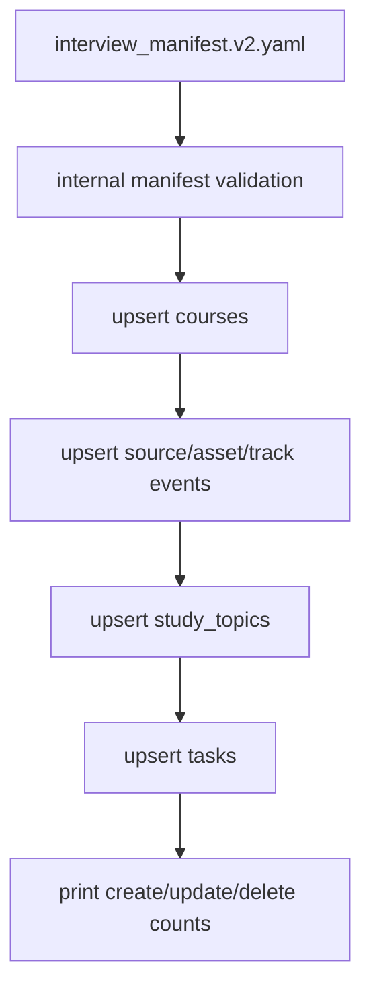

# Seeding OpenStudy

`scripts/curriculum/seed_openstudy.py` imports a schema v2 curriculum manifest
into the local OpenStudy database. It is deterministic and idempotent.

## Commands

Dry run:

```bash
python scripts/curriculum/seed_openstudy.py --dry-run --verbose
```

Apply:

```bash
python scripts/curriculum/seed_openstudy.py --verbose
```

Use an explicit manifest:

```bash
python scripts/curriculum/seed_openstudy.py \
  --manifest curriculum/interview_manifest.v2.yaml \
  --dry-run \
  --verbose
```

The script expects the same database environment as the backend:

```text
POSTGRES_USER
POSTGRES_PASSWORD
POSTGRES_DB
PGHOST
PGPORT
```

Inside the `openstudy` container, these come from Docker Compose env files.

## What Gets Seeded

| Manifest concept | OpenStudy persistence |
| --- | --- |
| Manifest meta | `courses` row plus JSON metadata in `courses.notes` |
| Track | `events` row with `kind = curriculum:track` |
| Source | `events` row with `kind = curriculum:source` |
| Asset | `events` row with `kind = curriculum:asset` |
| Module | `study_topics` row |
| Lesson | `tasks` row |
| Dependencies | JSON metadata on tasks/modules/course events |

The current OpenStudy schema does not have dedicated curriculum tables, so the
seed script uses existing tables and metadata fields.

## Mapping Details

### Course

The seed script uses OpenStudy course code `IE` by default. The manifest ID is
stored in metadata and `module_code`.

Natural key:

```text
courses.code = IE
```

### Modules

Modules become rows in `study_topics`.

Important fields:

- `course_code`: `IE`
- `chapter`: track name
- `name`: module name
- `description`: module description
- `kind`: `reading`
- `sort_order`: module `suggested_order`
- `notes`: marker plus JSON metadata

### Lessons

Lessons become rows in `tasks`.

Important fields:

- `course_code`: `IE`
- `title`: lesson title
- `description`: marker plus JSON metadata
- `priority`: `high` for high cognitive load, otherwise `med`
- `tags`: curriculum, lesson ID, module ID, category, cognitive load

The metadata includes:

- manifest ID
- schema version
- track ID
- module ID
- lesson ID
- type
- difficulty
- cognitive load
- completion criteria
- estimated minutes
- source reference
- inferred flag
- dependencies
- suggested order

### Sources, Assets, And Tracks

These are represented as `events` rows because OpenStudy does not currently
have dedicated tables for them.

Example event kinds:

```text
curriculum:source
curriculum:asset
curriculum:track
```

Each event payload contains a `seed_id` for idempotent update behavior.

## Idempotency

The seed script uses stable manifest IDs as natural keys. Running the same seed
again updates existing rows.

First run against an empty database:

```text
Courses: create=1, update=0
Sources: create=7, update=0
Assets: create=6, update=0
Tracks: create=1, update=0
Modules: create=16, update=0
Lessons/tasks: create=113, update=0
```

Second run:

```text
Courses: create=0, update=1
Sources: create=0, update=7
Assets: create=0, update=6
Tracks: create=0, update=1
Modules: create=0, update=16
Lessons/tasks: create=0, update=113
```

The marker format prevents prefix collisions between IDs such as
`ciu-second-lesson` and `ciu-second-lesson-extra`.

## Dry Run

`--dry-run` validates the manifest, connects to the database, reads existing
seeded rows, and prints planned creates or updates. It does not mutate the
database.

Use it before every production seed:

```bash
python scripts/curriculum/seed_openstudy.py --dry-run --verbose
```

## Reset Mode

The script supports:

```bash
python scripts/curriculum/seed_openstudy.py --reset --verbose
```

This is destructive for previously seeded data for the selected course. Prefer
normal idempotent updates unless you intentionally want to clear and reseed.

## Seed Flow



## Troubleshooting

### `POSTGRES_USER` Missing

Run inside the OpenStudy container or export the DB env vars:

```bash
docker compose exec openstudy python scripts/curriculum/seed_openstudy.py --dry-run --verbose
```

### Manifest Validation Fails

Run the validator directly:

```bash
python scripts/curriculum/validate_manifest.py curriculum/interview_manifest.v2.yaml
```

Fix errors before seeding. Warnings do not block seeding.

### Assets Warn As Missing

Check that source submodules are present and that the asset path exists under
the expected source repository.

### Duplicate Rows Appear

Do not manually edit seed markers in `courses.notes`, `study_topics.notes`, or
`tasks.description`. They are used to find existing rows.

